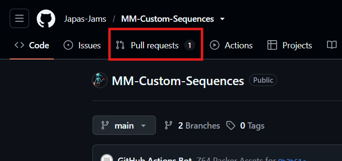
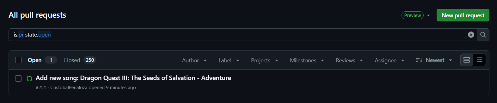
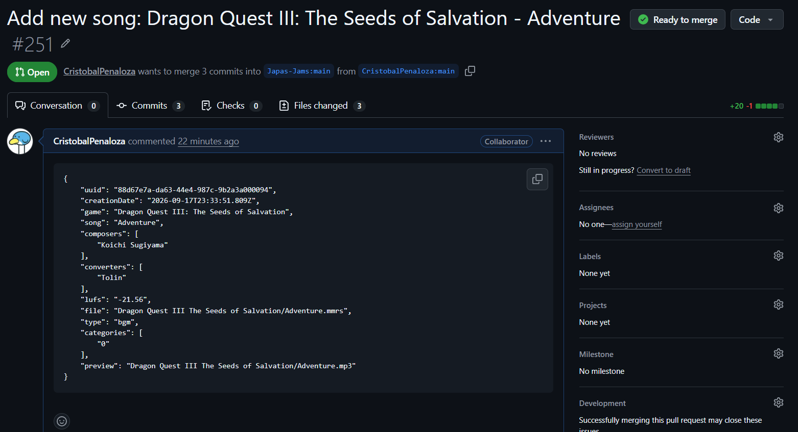
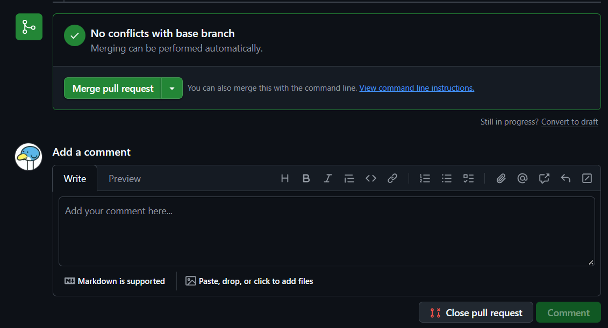
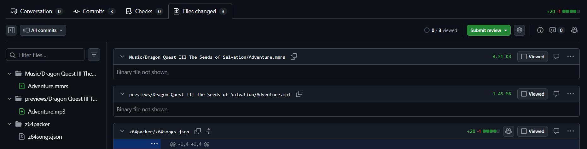
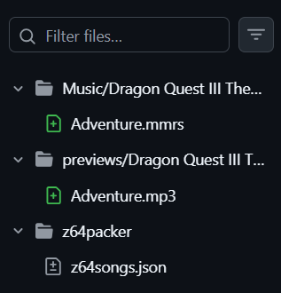
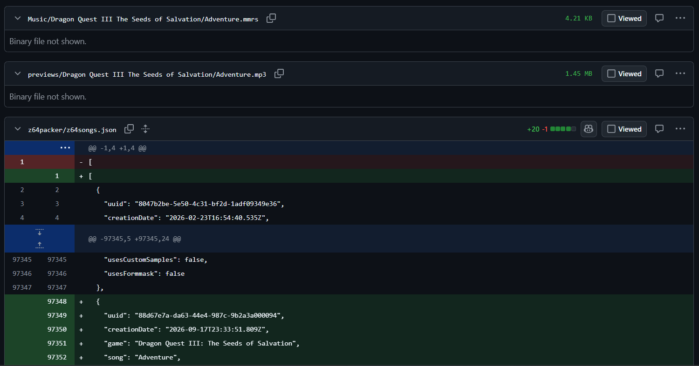
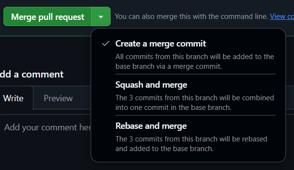

# Guide for approvers

So, you want to approve for a music repository.
Thank you ***so much*** for your help!

But, you're probably asking yourself...
*"How do I do it?"
"What do I check?"
"When should a song be accepted and when should be rejected?"*

Altough in the end you are probably going to just push some buttons, it's ***very important*** that you familiarize with how the packer works internally. You not only need to know *what* to do, but also know *why* you are doing it! 

So, to answer that, **we need to talk about GitHub**.

Here is a guide with the basic explanations of GitHub's lingo, and how it works. Please, give it a read!

[Z64 Song Packer - Why use Github? How does it work?](github.html)

You read it? You sure?

Amazing! Now, to the task at hand...

## The approval process

When someone creates a brand new PR, it will appear **in the "Pull Requests" tab** of it's repository GitHub page.



When you enter that tab, a list of all open pull request will be shown. Those are the ones that are not merged yet to the repository, so that's what we want to check!



When you click one, a page similar to this will appear:



Let's deglose it in section so we can understand it better. I will go over the things that you *may* need to use, and I will explain some the packer quirks on each step.


## The pull request

This page is divided into multiple sections.

### 1. Conversation

This is the main tab. Here you will see a comment thread on which you can interact with the contributor.



At the end of the page you can find a button to merge the pull request if submission is ok, or add a comment if something needs fixing.

### 2. Files changed

In this tab you can see what are the proposed changes that will be added to the repository if this pull request is approved.



#### File system changes

On the left you can what changes ocurred on the filesystem level. A green icon is an addition, a red icon is a deletion, and a grey icon is a change in the file itself.



So, in this case, two files where added (`Adventure.ootrs` and `Adventure.mp3`) and one was modified (`z64songs.json`).

#### Diff of files

On the right you can see a long list going over every file that changed on **diff** format.



The diff will show any lines added to a file on green, and any lines deleted on red. It will also automatically collapse any big chunks of lines that were not modified, so you can concentrate only on the relevant changes.

In this example, a bunch of lines were added to the `z64songs.json` file.

> Binary changes (like changes made to ootrs, mmrs, or mp3 files) are *never shown*. So, if you want to check them, you need to **download** those files. You can do that by pressing `3 dots > View File > 3 dots > Download`. Conveluted, but GitHub is dumb sometimes.


## The database format

Most submissions will make changes to the database, which is the `z64packer/z64songs.json` file.

This is an example of a database entry:

```
{
	"uuid": "88d67e7a-da63-44e4-987c-9b2a3a000094",
	"creationDate": "2026-09-17T23:33:51.809Z",
	"game": "Dragon Quest III: The Seeds of Salvation",
	"song": "Adventure",
	"composers": [
		"Koichi Sugiyama"
	],
	"converters": [
		"Tolin"
	],
	"lufs": "-21.56",
	"file": "Dragon Quest III The Seeds of Salvation/Adventure.mmrs",
	"type": "bgm",
	"categories": [
		"0"
	],
	"preview": "Dragon Quest III The Seeds of Salvation/Adventure.mp3"
}
```

> Disclaimer: most users will paste the database entry on the main comment of the PR, as recommended by the form. But this can be modified or completely omited. So use the **Files changed** tab to see exactly what changed.

This is the entry that is going to enter the database for the repository. Is in JSON format. It contains the medatada that will be presented on the packer, so you need to check if it's ok. Here are the relevant values:

* **game**: The game where this songs come from. It needs to be it's ***full name***. In this example, if it was something like *Dragon Quest III, Dragon Quest 3, DQ3*, etc., it would be wrong, because it will produce a duplicated folder on the packer.

* **song**: The name of the song. Make sure to use the ***official name***, or it's most common one. If the song is already on the packer, a number should be appended between brackets to differentiate it (e.g. `[2]`).

* **composers**: A list of composers, in array format (e.g. `[ "Composer 1", "Composer 2" ]`). Be sure that the original composer is included, and it's aranger  if the song is a remix. Make sure the are no typos/case differences in the names. If not, the filter will have duplicated entries

* **converters**: A list of converters, in array format. The converter is *who* did the port to Z64 format. The same rules for converters apply here.

* **type**: can be `bgm` or `fanfare`. Make sure that it matches what the song is.

* **lufs**: the value of the loudness measuring of the song. Follow the [lufs guide](lufs.html) if you want re-record the song to confirm the value is correct. Songs usually fit in the range of -20 to -10, so something higher or lower is suspicious... probably there is a wrong measuring or bad mixing. **Follow the guidelines in the appendix on the lufs guide** to make sure the mixing is good quality.

* **categories**: the internal list of categories of the song. Make sure the contributor mindfully picked their categories. As a rule of thumb, **allow only a max of 1 or 2 *general categories*** (no "this song can appear anywhere"). Any amount of *specific categories* is ok.

## What to do if something is wrong

If you pickup on something, make it known!

### If the problem is fixable...

**Make a comment!** Indicate the contributor what needs to be fixed in order to be approved. Be detailed and helpful if they don't know exactly what to do or how to do it.

Fixable problems is stuff like: wrong song name, wrong game name, wrong composers, broken type, bad categories, lufs issues, compatibility issues.

> DON'T close the pull request if it just needs fixing!

### If the problems is NOT fixbable...

**Close the pull request**. Add a comment with the reason. Be very clear as to why this decision was made.

Non fixable problems is stuff like: dmca risks, wrong format, file duplication (not at variant; an exact dupe in this repo or in another), abandonment, constant break of rules.

> Also, please be nice to the contributors... This stuff can be as frustrating to them as it is to you. Be friendly and helpful as you can!

## What to do if everything is ok

Now it's the time to **merge** the changes to the repository! You'll see that you are given 3 options.



> I will not go into much detail because this is another rabbit hole that I think is unnecesary to understand completely. But, if you *do* want to know more, feel free to google it tho, I will not stop you!

- **Create a merge commit**: this is the one you will be using on most ocassions. Moves all the commits from the fork to the repository, and creates a new one for the merge. Very informative, but messy.

- **Squash and merge**: use it if there are ***a lot*** of commits to merge. Combines every commit from the fork into a single one. Very tidy and performant for these situations. Altough, the submitter may need to delete their fork and re-create it, since this will break it's history.

- **Rebase and merge**: don't use it. Altough is the tidiest one for plenty of ocassions, it rewrites the history and can hide what was merged and what was modified directly.

---

That should be all you need to know for now!

Again, thank you very much for your help!
