# How to get the loudness (LUFS) of your song

Alright, you have your shiny new song ready for the upload. That's great!
But now, in the submission form they ask you to put a loudness recording? What the heck is that!
This guide will help you record a preview with direct emulator audio, and get their lufs.

## What is loudness and why it's important

If you haved played a rando with custom music enabled, it has probably happened to you that some songs are so silent you barely hear them, while others are so loud that make your ears bleed!

That happens, because the songs are **not audio balanced**.
Human perception of audio is different for everyone. Some players want their songs louder. Other prefers them more quieter. And doesn't help that the N64 Zelda games have a very dynamic volume for their music (boss music is much louder that town music, for example). That's why most games nowadays have a music volume slider!

### Loudness measurings to the rescue!

***Loudness Units Full Scale*** (commonly known as LUFS) is a measure of **perceived** volume. It's used on most of the music platforms (like Spotify or Apple Music) to normalize the volume, so that all songs sound similar to each other.

And the song packer is no exception! Most of the songs have a LUFS recording, and that allows the packer to adjust the volume of the songs dynamically, depending on user preference.

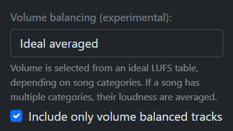
> Volume balancing is enabled by default. So if your song doesn't have it's LUFS recording, it may be omited on download.

# How to get it?

For the volume balancing to work, is essential that all recording come from the **same source**. We currently use BizHawk, since it allows audio recording directly from the game, without any modifications by any other program.

## 1. Install the necesary tools

These are the tools you'll need:

- [BizHawk](https://github.com/TASEmulators/BizHawk/releases/tag/2.11.1): Emulator to record audio (2.11 recommended)
- [Z64 Music Manager](https://github.com/CristobalPenaloza/Z64MusicManager/releases): Helper app to streamline the recording process (Windows only)
- [mm-rando](https://github.com/ZoeyZolotova/mm-rando/releases): Needed if you plan to record mmrs files
- [OoT-Randomizer](https://github.com/OoTRandomizer/OoT-Randomizer/releases): Needed if you plan to record ootrs files

Install all of these apps and have them in a known place.

**IMPORTANT**: For the randomizers, they need each to have their vanilla ROMs setup so that they are able to create randomizer seeds. Follow their respective guides on how to do it (altough you probably know that, already).

## 2. Record audio with Z64 Music Manager

> **WARNING**: Z64 Music Manager may give you a "Windows protected your PC" SmartScreen warning when trying to install. That's normal because the app is not currently validated. If you're worried, all the source code is published in GitHub, so you can check it out.
>
> But rest assured: *the app is not a virus*.

There are some steps you have to make so that Z64 Music Manager is ready to record audio. You only need to do this once.

1. When the app it's installed, you may notice that all your mmrs and ootrs files have a shiny new icon. **Double click any file**, the program will open and show information about it. **Do not press the "Record" button yet**.

    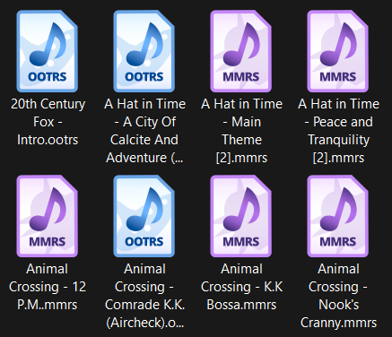
    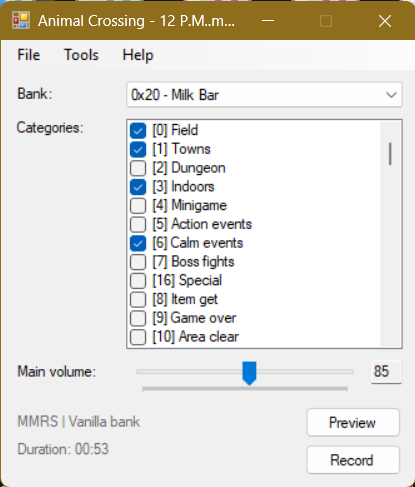

2. Go to **File > Settings** and in the new window you will be presented with some options. The ones under **Tools** is what you need to setup.

    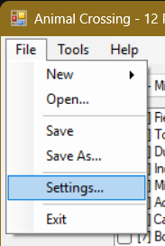
    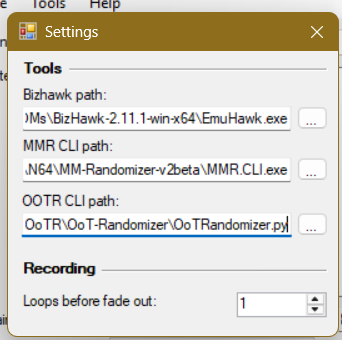

3. For **BizHawk path** press the **[...]** button and go to your installation of BizHawk and select **EmuHawk.exe**.

4. For **MMR CLI path** press the **[...]** button and go to your installation of mm-rando and select **MMR.CLI.exe**. Only need to do this if you plan to record MMRS files.

5. For **OOTR CLI path** press the **[...]** button and go to your installation of OoTRandomizer and select **OoTRandomizer.py**. Only need to do this if you plan to record OOTRS files.

6. Close the settings window, and press the **Record** button. After a while, the emulator will pop up and start recording your song really fast. Wait until the emulator closes itself.

    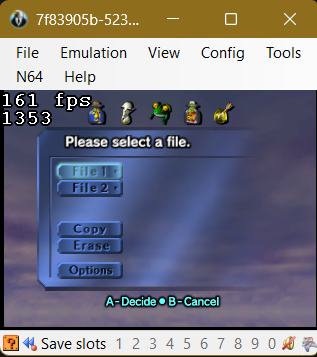

7. You're done! An mp3 file with the recording will be next to your file.

    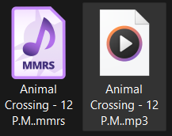

## 3. Get the LUFS value

For this will be using Ballam's Loudness Tester.
This was made for dk64randomizer.com, but it serves our purposes also.

1. Go here: https://theballaam96.github.io/loudness_tester.html

2. Press the big **Load file** button, and select the mp3 recording you just made.

    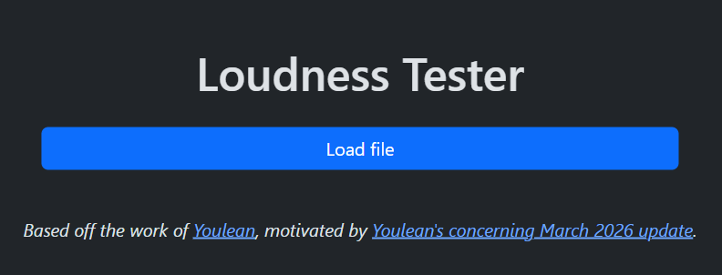

3. You will be shown a fancy graphic with an analysis of the song. The value we are interested is the **Integrated Max**. Copy that value to a safe place.

    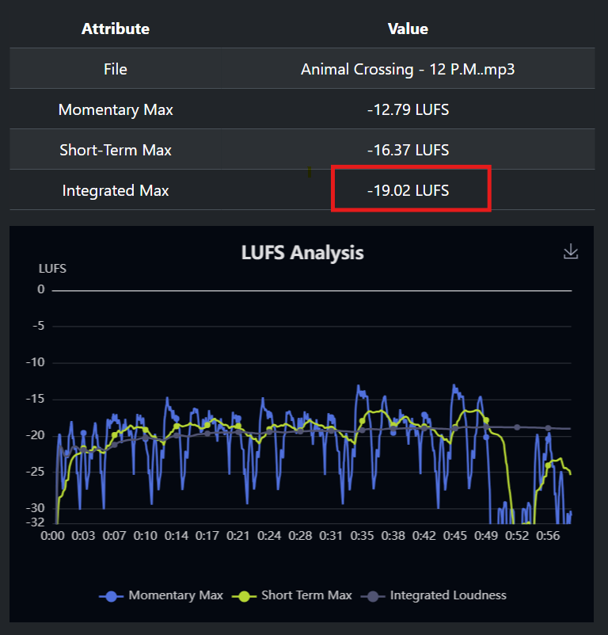

4. And you're done! Just put that value in the submission form, and you are good to go!

## Appendix: A bit more about mixing and volume balancing

### 1. How volume balancing works

When you select a volume balancing in the packer, for each song is decided a **target loudness** that it should hit for it's location. So, we take the lufs value you set for your song, and raise or lower the volume to match that target loudness *exactly*.

For example, the song above measured an integrated of -19.02 LUFS. If the user puts the packer at Flat balancing, the target loudness of this song will become -17.00 LUFS. So, with a *fancy formula*, we will **raise** the volume of the song about 2 decibels.

This system works very well, but only for songs **that are properly mixed**.

### 2. Peaks and lows

Altough you only include the **Integrated Max**, the other values in the graph can help you identify annoying peaks of volume, that will mess up the balancing.

* **Momentary Max**: is the highest recorded loudness measured in a *400 millisecond window*. Allows you to identify annoying peaks of volume in the song.

* **Short-Term Max**: is the highest recorded loudness measured in a *3 second window*. Allows you to identify big differences in volume in sections of a song.

* **Integrated Max**: is the averaged overall loudness of the *whole song*.

Let's go over a few examples and see how the volume balancing will affect those songs, and how can you prevent issues:

#### EXAMPLE 1

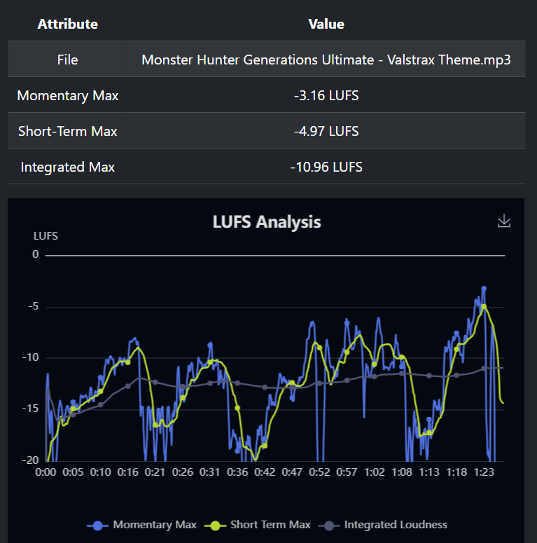

This is **PRETTY BAD**.

If you follow the integrated line (the grey one) with the rest, you'll see that it doesn't match at all what volume is playing currently in the song.

On the other hand, you can insane peaks on the momentary line (the blue one), around ~8dB from the integrated. High chance there are perforating instruments (like piccolo or oboe) playing at max at some points. 

All this means is that, no matter what balance you use, **the song will be super loud or super silent at every single point it's played**.

This would probably be rejected by approvers.

#### EXAMPLE 2

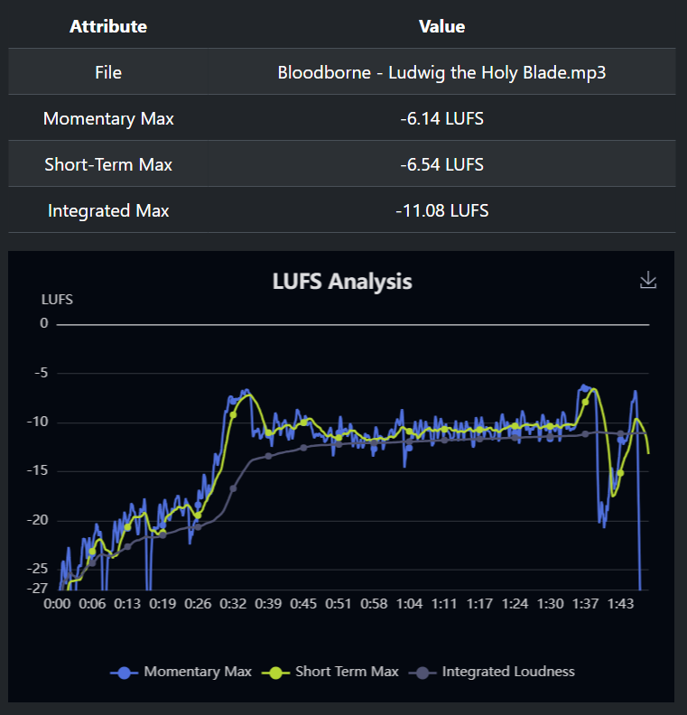

This is **PASSABLE, BUT NOT VERY GOOD AT ALL**:

The momentary line is very close to the others, and there are no peaks anywhere, so that's ok.

*But*, there is a very big difference in volume from the first 30 seconds to the rest of the song.

This would mean that in-game **the intro of the song will be almost silent**.

This might be rejected by approvers.

#### EXAMPLE 3

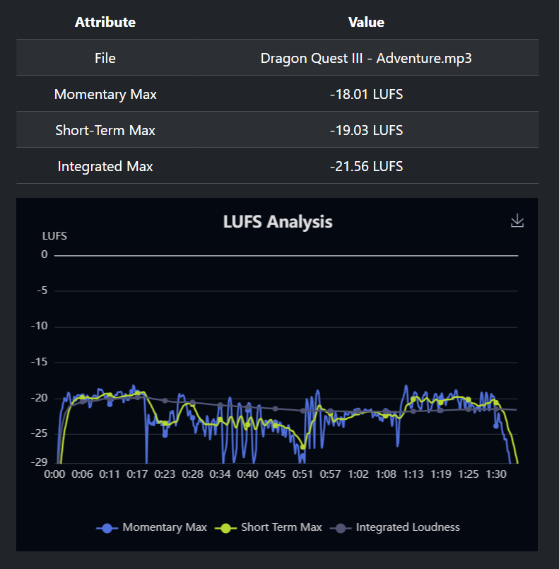

This is **PERFECT**.

The graphs seems very flat, with all the loudness measurings very close to each other. No insane peaks, or insane lows; the volume dances comfortably around ~3dB of the integrated.

The song will be heard very clearly in game, and will definetly be approved.

### What did we learn?

- **Prefer flat mixing**. Make sure the difference between integrated and momentary is *not higher than **3*** for boss fights, action stuff or minigames; and *not higher than **5*** for more calmer tracks. Check if the integrated line in the graph is close to the others.

- **Avoid annoying peaks**. See if there is a difference of 1 or 2 between short-term and momentary. Check the graph for visual peaks in the momentary line. There are other ways to highlight parts of a song than just volume (like instruments changes or combinations).

- **Avoid big differences in volumes for sections of your song**. Check if the graph have big changes volume for a *prolonged amount of time*. Make sure the integrated line stays flat or changes minimally, so your song is clearly heard for all it's duration.

Use this as rules of thumb when mixing your songs!

